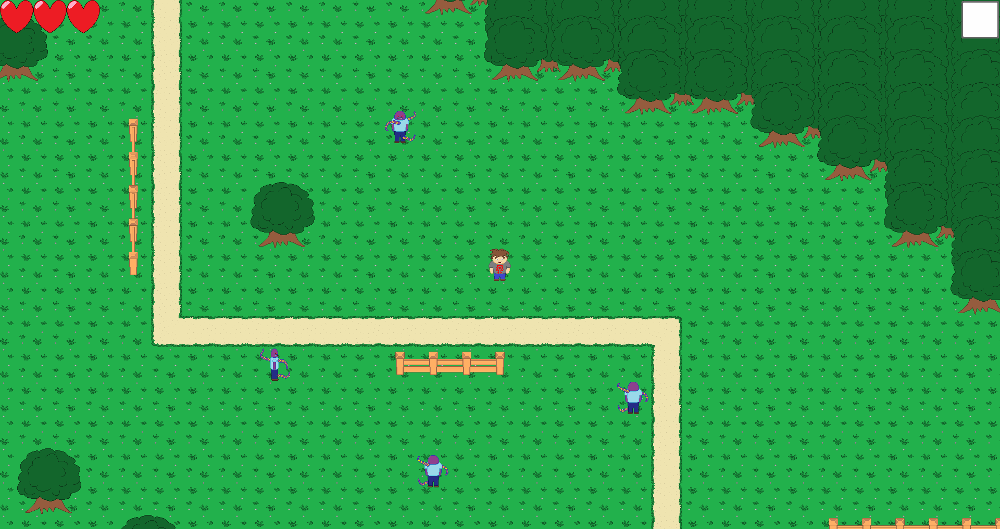

# [Python3][PySFML] Endless-History - Mini-RPG 2D

## Description technique

Ce jeu a été développé entre 2016 et 2018, au début de mes études supérieures, en utilisant Python 3.2.5 et la PySFML.
Vous l'aurez compris à la lecture de la version, ce projet n'est plus du tout mis à jour depuis plusieurs années, mais il est cependant toujours jouable... dépendant de la machine et de l'OS. En tout cas sur ma machine (Ryzen 7 2700X, 1920x1080, Windows 10) le jeu tourne parfaitement.

Si vous voulez le tester vous trouverez un lien de téléchargement vers l'executable compilé en bas de ce README. Si vous voulez le compiler vous-même... et bien bonne chance ! Je peux tout de même vous donner la version des bibliothèques que j'utilisais:
- Python 3.2.5
- PySFML 1.3.0
- Cx_Freeze 4.3.1.

## Description du jeu

Il s'agit d'un petit RPG 2D inspiré de *The Legend of Zelda: A link to the past*.

L'histoire est relativement simple. Mes deux jeux précédents ([Endless-Caves](https://github.com/Reiex/Endless-Caves) et [Endless-Rooms](https://github.com/Reiex/Endless-Rooms)) étaient en réalité dans le même continuité scénaristique.
Notre héros, donc, conscient de son statut de personnage de jeu vidéo, fini par réussir à sortir de sa grotte et découvre un monde étrange peuplé de monstres tout aussi... étranges (et moche, faut bien se l'avouer).
Il découvre alors ce monde de jeu vidéo développé par un nul dans lequel il évolue. La suite, c'est du spoil !

Et pour finir (vos yeux) une petite image du jeu:

- Téléchargement de l'executable: [Mediafire](http://www.mediafire.com/file/pkykgkkcrgaxbyj/Endless-history.rar/file)
- Page Itch.io du jeu: [Itch.io/endless-history](https://my-fucking-games.itch.io/endless-history)
